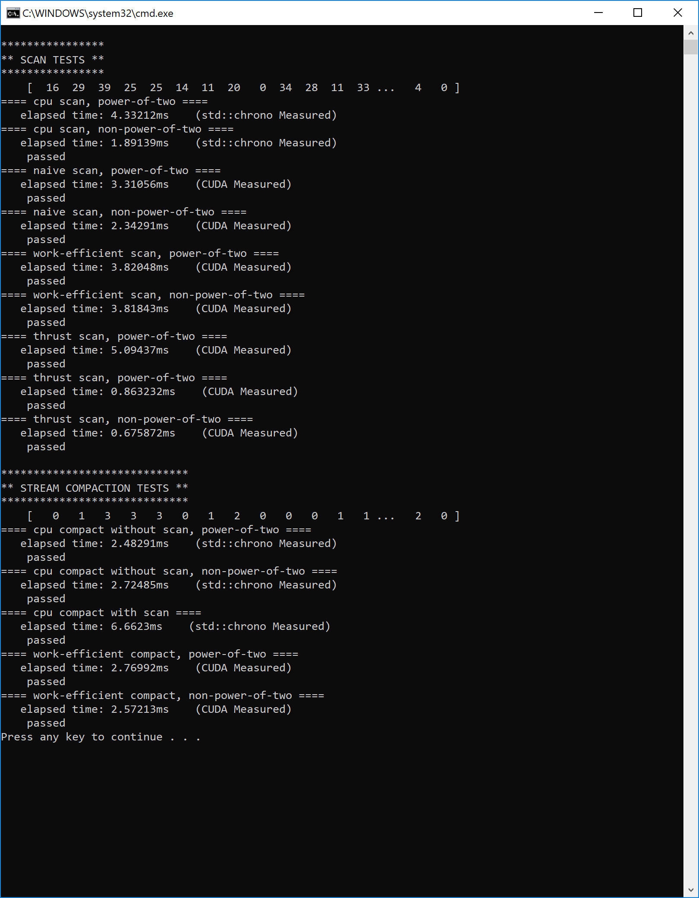
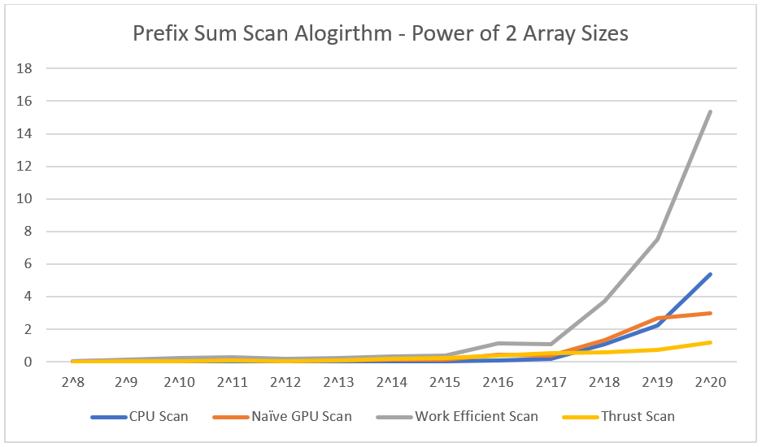
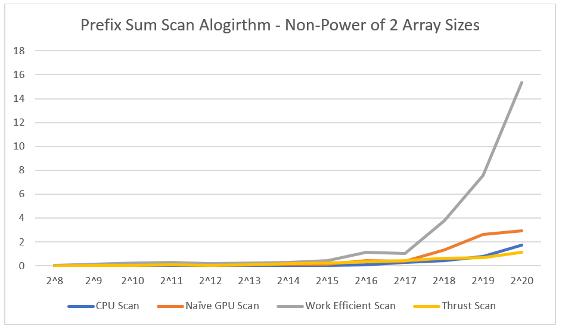
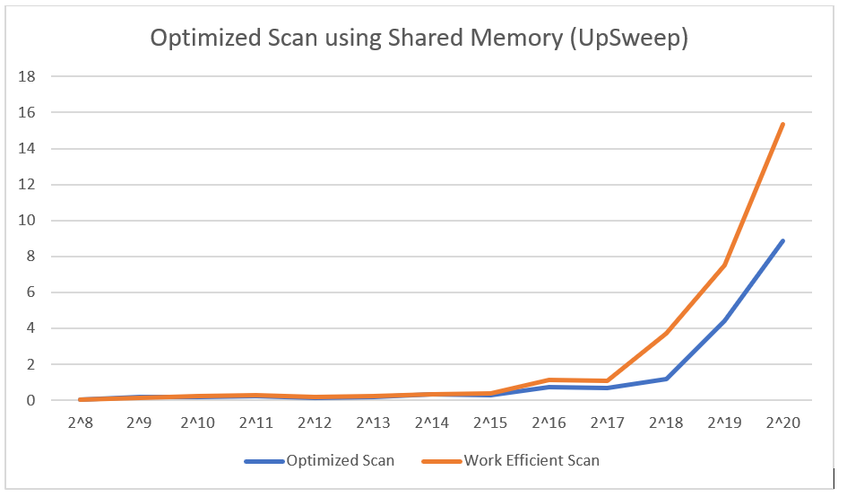
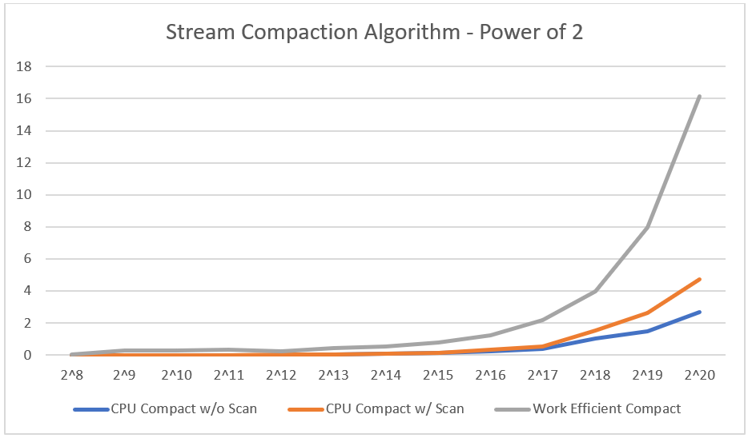
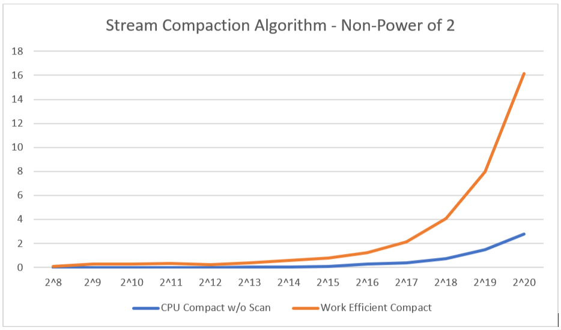

CUDA Stream Compaction
======================

**University of Pennsylvania, CIS 565: GPU Programming and Architecture,
Project 1 - Flocking**

* Vasu Mahesh
  * [LinkedIn](http://linkedin.com/in/vasumahesh)
  * [Code Blog](http://www.codeplaysleep.com)

* Tested on a Laptop:
  * Windows 10
  * i7-8650U @ 1.90GHz
  * 16GB RAM
  * GTX 1060 6GB
  * Visual Studio 2017 (with v140 toolset)
  * CUDA v8.0



## Build

Build Command: 
```
cmake -G "Visual Studio 15 2017 Win64" -DCUDA_TOOLKIT_ROOT_DIR="C:\Program Files\NVIDIA GPU Computing Toolkit\CUDA\v8.0" -T v140,cuda=8.0 ..
```
I tried to implement the shared memory and thread optimziation. But had issues with DownSweep and kind of ran out of time.

## Results

### Scan Performance

If we just implement the barebones scan algorithm it turns out that they are quite slower. A point to note here Thrust initially had a pretty slow time of around 4ms and then the subsequent Thrust calls are very fast. I suspect Thrust lazy loads some modules and since the thrust scan function was the 1st one, it affected the readings. To avoid this, I ended up calling scan again and got optimal performance.





| Elements in Array  | CPU Scan (Power of 2) | CPU Scan (Non Power of 2) | Naive Scan (Power of 2) | Naive Scan (Non Power of 2) | Work Efficient Scan (Power of 2) | Work Efficient Scan (Non Power of 2) | Thrust Scan (Power of 2) | Thrust Scan (Non Power of 2) |
| ----------- |------------------------------------|-------------------------------------- |-----------------|-----------------|-----------------|-----------------|-----------------|-----------------|
| 2^8  | 0.000485 | 0.000485 | 0.027648 | 0.02672  | 0.062464 | 0.053248 | 0.012288 | 0.012288 |
| 2^9  | 0.00097  | 0.001455 | 0.07168  | 0.068608 | 0.16384  | 0.159744 | 0.037888 | 0.065536 |
| 2^10 | 0.001454 | 0.001455 | 0.121856 | 0.120832 | 0.262144 | 0.260096 | 0.066592 | 0.065536 |
| 2^11 | 0.002909 | 0.00291  | 0.138208 | 0.13824  | 0.292864 | 0.29696  | 0.099328 | 0.098304 |
| 2^12 | 0.006303 | 0.007272 | 0.094208 | 0.093184 | 0.195584 | 0.195584 | 0.068608 | 0.068608 |
| 2^13 | 0.011636 | 0.012121 | 0.104416 | 0.104448 | 0.227264 | 0.22528  | 0.114688 | 0.114656 |
| 2^14 | 0.024727 | 0.024242 | 0.134176 | 0.123904 | 0.32256  | 0.31744  | 0.19248  | 0.191456 |
| 2^15 | 0.049455 | 0.055273 | 0.16688  | 0.166912 | 0.40336  | 0.423904 | 0.224224 | 0.22016  |
| 2^16 | 0.090182 | 0.100364 | 0.42864  | 0.427808 | 1.12845  | 1.12813  | 0.39424  | 0.343072 |
| 2^17 | 0.188121 | 0.27103  | 0.390816 | 0.390144 | 1.0687   | 1.05984  | 0.55088  | 0.451584 |
| 2^18 | 1.07976  | 0.442182 | 1.35885  | 1.34733  | 3.74992  | 3.77731  | 0.605184 | 0.628736 |
| 2^19 | 2.2177   | 0.796606 | 2.67267  | 2.64694  | 7.54173  | 7.57734  | 0.754688 | 0.709632 |
| 2^20 | 5.36679  | 1.74352  | 3.00848  | 2.95424  | 15.3444  | 15.3364  | 1.1745   | 1.1223   |

There seems to be such a discrepency in my Work Efficient one because I believe it is highly inefficient (shared memory difference below). The Work efficient one performed poorly for me even against my CPU. This could be because the threads aren't grouped and the waste the SM's utilization. After the class, I realized that the implemented code could be way faster as I was launching N threads for N numbers (in total). This was later resolved to N/2. The values however you see are for the "naive" version of the work efficient algorithm.

### Scan with Shared Memory

I implemented a partial implementation of the Work Efficient Scan (Only UpSweep). I got a significant boost because I ended up launching only the required amount of threads for the entries in the array. However, this implementation was a little different and I believe less efficient than the one shown in class. This is because the threads are not clumped together. Grouping of threads is much better because it helps in early warp termination.



### Compaction Performance

I suffered similar performance issues with work efficient scans in the compact as well.





| Elements in Array  | CPU Compact without scan (Power of 2) | CPU Compact without scan (Non Power of 2) | CPU Compact with Scan | Work Efficient Compact (Power of 2) | Work Efficient Compact (Non Power of 2) |
| ----------- | ----------- | ----------- | ----------- | ----------- | ----------- |
| 2^8  | 0.000969 | 0.000969 | 0.00097  | 0.06144  | 0.072704 |
| 2^9  | 0.020849 | 0.001455 | 0.002909 | 0.291872 | 0.274432 |
| 2^10 | 0.003394 | 0.002424 | 0.004849 | 0.296928 | 0.296928 |
| 2^11 | 0.007758 | 0.005819 | 0.010182 | 0.330784 | 0.338912 |
| 2^12 | 0.011636 | 0.016    | 0.050909 | 0.234464 | 0.238592 |
| 2^13 | 0.054304 | 0.020848 | 0.055272 | 0.442304 | 0.413696 |
| 2^14 | 0.077091 | 0.067878 | 0.092121 | 0.557024 | 0.5816   |
| 2^15 | 0.123152 | 0.112    | 0.157576 | 0.785088 | 0.767744 |
| 2^16 | 0.246788 | 0.269576 | 0.343758 | 1.21734  | 1.23866  |
| 2^17 | 0.390788 | 0.402424 | 0.555637 | 2.16781  | 2.13808  |
| 2^18 | 1.06182  | 0.744727 | 1.53648  | 4.00554  | 4.0591   |
| 2^19 | 1.488    | 1.48994  | 2.63418  | 7.96368  | 7.97901  |
| 2^20 | 2.69624  | 2.80679  | 4.72727  | 16.1515  | 16.1321  |


### Output Log

```
****************
** SCAN TESTS **
****************
    [  16  29  39  25  25  14  11  20   0  34  28  11  33 ...   4   0 ]
==== cpu scan, power-of-two ====
   elapsed time: 7.32024ms    (std::chrono Measured)
==== cpu scan, non-power-of-two ====
   elapsed time: 2.39758ms    (std::chrono Measured)
    passed
==== naive scan, power-of-two ====
   elapsed time: 1.45482ms    (CUDA Measured)
    passed
==== naive scan, non-power-of-two ====
   elapsed time: 1.45306ms    (CUDA Measured)
    passed
==== work-efficient scan, power-of-two ====
   elapsed time: 1.80938ms    (CUDA Measured)
    passed
==== work-efficient scan, non-power-of-two ====
   elapsed time: 1.8143ms    (CUDA Measured)
    passed
==== thrust scan, power-of-two ====
   elapsed time: 4.02115ms    (CUDA Measured)
    passed
==== thrust scan, power-of-two ====
   elapsed time: 0.503808ms    (CUDA Measured)
    passed
==== thrust scan, non-power-of-two ====
   elapsed time: 0.471008ms    (CUDA Measured)
    passed

*****************************
** STREAM COMPACTION TESTS **
*****************************
    [   0   1   3   3   3   0   1   2   0   0   0   1   1 ...   2   0 ]
==== cpu compact without scan, power-of-two ====
   elapsed time: 4.38158ms    (std::chrono Measured)
    passed
==== cpu compact without scan, non-power-of-two ====
   elapsed time: 3.77454ms    (std::chrono Measured)
    passed
==== cpu compact with scan ====
   elapsed time: 12.5959ms    (std::chrono Measured)
    passed
==== work-efficient compact, power-of-two ====
   elapsed time: 2.10064ms    (CUDA Measured)
    passed
==== work-efficient compact, non-power-of-two ====
   elapsed time: 2.10413ms    (CUDA Measured)
    passed
Press any key to continue . . .
```